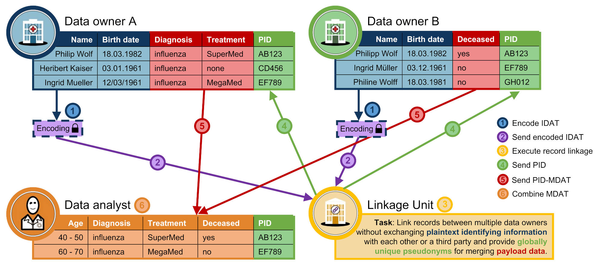
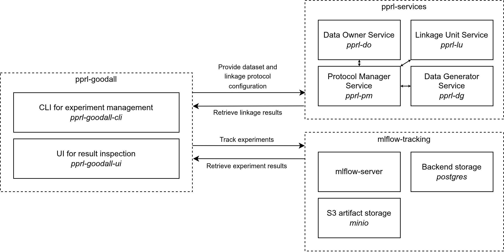

# Goodall: Experiment management and analysis for Privacy-Preserving Record Linkage (PPRL)

Record linkage aims at linking records that refer to the same real-world entity,
such as persons. Typically, there is a lack of global identifiers, therefore the
linkage can only be achieved by comparing available quasi-identifiers, such as name,
address or date of birth. However, in many cases, data owners are only willing
or allowed to provide their data for such data integration if there is sufficient
protection of sensitive information to ensure the privacy of persons,
such as patients or customers.
**Privacy Preserving Record Linkage (PPRL)** addresses this problem by providing
techniques to match records while preserving their privacy allowing the combination
of data from different sources for improved data analysis and research.
For this purpose, the linkage of person-related records is based on encoded values
of the quasi-identifiers and the data needed for analysis (e.g., health data) is
separated from these quasi-identifiers. The relevant data can be provided to a
researcher without the identifying data.



The **data owner services** irreversibly transform the original plaintext to an encoded representation before
sharing this encoded data with a third party for linkage.
A popular encoding technique is based on Bloom filter data structures which is also the focus of this implementation.

The **linkage unit service** receives the encoded records and applies a matching algorithm
to determine entity clusters. The service supports multiple configurable classification models which allows
the execution of conventional plaintext linkage algorithms as well. Intermediate and final linkage
results including pairs are managed per project, separate from the records themselves, which allows
to efficiently test multiple linkage approaches on the same (encoded) dataset.

## Usage
This project provides an evaluation framework for conducting experiments using various datasets and
linkage protocol configurations.
Please read the corresponding [paper](https://www.vldb.org/2025/Workshops/VLDB-Workshops-2025/QDB/QDB25_2.pdf) for more information.
The framework comprises the following components:
- **pprl-services stack**: Provides methods for PPRL linkage (encoding and matching) and benchmark dataset creation.
See also [pprl-services repository](https://github.com/floroh/pprl-services)
- **mlflow stack**: [Mlflow server](https://mlflow.org/) with storages for tracking the experiments.
- **pprl-goodall-cli**: Command line interface for managing the experiments.
- **pprl-goodall-ui**: Streamlit-based web frontend for the pprl services and experimental results.



### Quick start
```shell
# Create shared docker network for all services
docker network create pprl-services

# Start PPRL services
cd pprl-services
cp default.env .env
docker compose up -d

# Start mlflow services
cd ../mlflow-tracking
cp default.env .env
docker compose -f docker-compose.yml -f docker-compose-local.yml up -d
docker exec -t mlflow-server bash -c "cd /opt && python user_setup.py"
cd ..

# Should show status "healthy" for all services
docker compose run --rm pprl-goodall-cli

# Prepare and run example experiments
./experiment-example-runs.sh
docker compose up pprl-goodall-ui -d
```
- Open [http://127.0.0.1:8501/MlFlow](http://127.0.0.1:8501) to inspect the results 

### Non-dockered usage
#### Prerequisites
- Python >=3.12
- [poetry](https://python-poetry.org/docs/)
- Running PPRL Services

#### Installation
Install dependencies using [poetry](https://python-poetry.org/docs/)
```shell
poetry install
```

#### Usage
Start Streamlit UI:
```shell
poetry run python3 -m streamlit run goodall/ui/PPRL_Services_UI.py
```

Run experiments, e.g., generate synthetic datasets
```shell
poetry run python -m goodall.tracking.experiment_manager_cli run -c test-create-generate.json
```

## Citation
If you use this software, please cite the [paper](https://www.vldb.org/2025/Workshops/VLDB-Workshops-2025/QDB/QDB25_2.pdf) in your work.
```tex
@inproceedings{Rohde2025evalframework,
title={Exploring Privacy-Preserving Record Linkage: A Holistic Framework for Dataset Generation and Detailed Result Analysis},
author={Rohde, Florens and Christen, Victor and Rahm, Erhard},
booktitle = {VLDB 2025 Workshop: 14th International Workshop on Quality in Databases (QDB'25)},
address = {London},
year = {2025},
}
```

## Development

### Update PPRL services API
The API clients for the PPRL services are generated using the [OpenAPI Generator](https://openapi-generator.tech/)

Use the helper scripts to update the clients when there is a relevant
[update of the openapi-generator](https://github.com/OpenAPITools/openapi-generator/releases)
(update the docker image tag in the scripts accordingly)
or the API of the PPRL services changed.
The scripts expect running PPRL services on localhost on ports :8181 (do),
:8182 (lu), :8185 (pm) and :8186 (dg) which is the default setup in the
[docker-compose.yml](./pprl-services/docker-compose.yml).

```shell
./api/update_client_do.sh
./api/update_client_lu.sh
./api/update_client_dg.sh
./api/update_client_pm.sh
```
or everything at once:
```shell
./api/update_clients.sh
```